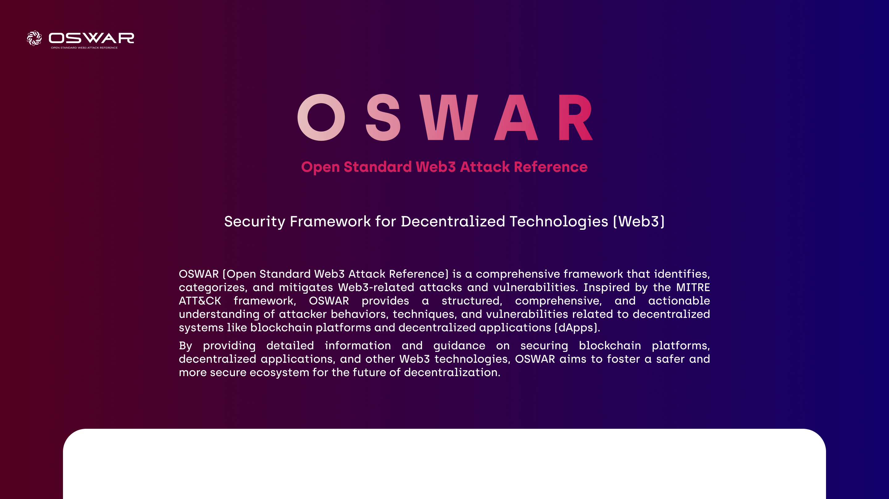

# OSWAR (Open Standard Web3 Attack Reference)

OSWAR is a comprehensive framework inspired by the **MITRE ATT&CK framework**, designed to identify, categorize, and mitigate `Web3`-related attacks and vulnerabilities. It provides a structured and actionable understanding of attacker behaviors, techniques, and vulnerabilities specific to decentralized systems such as blockchain platforms and decentralized applications (dApps).

## Purpose
The primary goal of OSWAR is to foster a safer and more secure ecosystem for the future of decentralization. By offering detailed information and guidance on securing blockchain platforms, decentralized applications, and other Web3 technologies, OSWAR aims to empower developers, auditors, and security researchers with the knowledge they need to defend against potential threats.

## Features
- **Comprehensive Attack Catalog**: OSWAR provides an extensive catalog of Web3-related attacks and vulnerabilities, organized into categories for easy navigation and reference.
- **Attack Techniques and Tactics**: Each attack in the catalog is accompanied by detailed information about the techniques and tactics employed by attackers, helping users gain a deeper understanding of potential threats.
- **Mitigation Strategies**: OSWAR offers actionable guidance and best practices to mitigate each identified attack, providing developers and security practitioners with effective countermeasures.
- **Community Collaboration**: OSWAR is an open standard framework, `encouraging collaboration and contributions from the Web3 community` to enhance the knowledge base and improve the overall security of decentralized systems.

Join our community!
- Telegram chat: https://t.me/oswarcommunity
- LinkedIn: https://www.linkedin.com/company/oswar/
